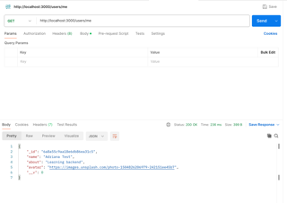
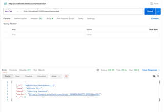
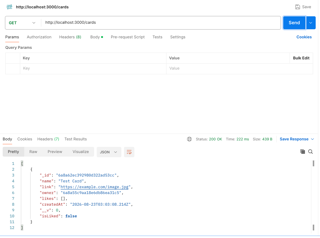
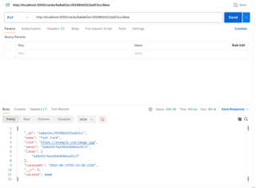

# Around Express API

Backend desarrollado con **Node.js**, **Express**, **TypeScript** y **MongoDB** como parte del programa de Desarrollo Web de TripleTen.

## Descripción

Esta aplicación implementa una API REST para el proyecto Around, permitiendo administrar usuarios y tarjetas mediante MongoDB y Mongoose.

## Funcionalidades

### Usuarios

- Obtener todos los usuarios.
- Obtener un usuario por ID.
- Crear un usuario.
- Obtener el usuario actual (`/users/me`).
- Actualizar nombre y descripción.
- Actualizar avatar.

### Tarjetas

- Obtener todas las tarjetas.
- Crear una tarjeta.
- Eliminar una tarjeta.
- Dar "Like" a una tarjeta.
- Quitar "Like" de una tarjeta.

### Manejo de errores

- Middleware centralizado para el manejo de errores.
- Validación de ObjectId.
- Validaciones mediante Mongoose.
- Respuestas HTTP 400, 401, 404 y 500.

## Tecnologías

- Node.js
- Express
- TypeScript
- MongoDB
- Mongoose
- ESLint
- EditorConfig

## Endpoints principales

### Usuarios

- GET `/users`
- GET `/users/:id`
- POST `/users`
- GET `/users/me`
- PATCH `/users/me`
- PATCH `/users/me/avatar`

### Tarjetas

- GET `/cards`
- POST `/cards`
- DELETE `/cards/:id`
- PUT `/cards/:id/likes`
- DELETE `/cards/:id/likes`

## Screenshots

### GET /users

### GET /users/me

### PATCH /users/me/avatar

### GET /cards

### PUT /cards/:id/likes

## Lo que aprendí

Durante este proyecto aprendí a:

- Construir una API REST con Express.
- Modelar datos con MongoDB y Mongoose.
- Implementar operaciones CRUD.
- Relacionar documentos mediante ObjectId.
- Manejar errores con un middleware centralizado.
- Validar datos utilizando Mongoose.
- Trabajar con TypeScript en un entorno backend.

## Autor

**Adriana Capriles**