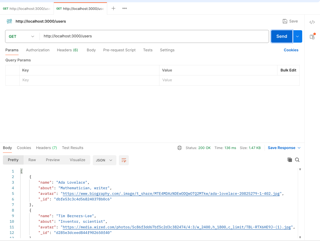
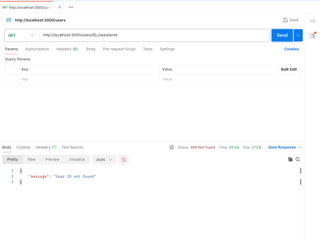

# Tripleten web_project_around_express
# Around Express API

Backend desarrollado con Express y TypeScript como parte del programa de Desarrollo Web de TripleTen.

## Descripción

Esta aplicación implementa una API REST básica para el proyecto Around. Actualmente permite:

- Obtener la lista de usuarios.
- Obtener la lista de tarjetas.
- Obtener un usuario por su ID.
- Manejar errores 404 para recursos inexistentes.
- Manejar errores 500 del servidor.

Los datos se leen desde archivos JSON utilizando el módulo `node:fs/promises`.

## Tecnologías

- Node.js
- Express
- TypeScript
- ESLint
- EditorConfig

## Screenshots

### GET /users

### GET /users/:id (404)

## Estado del proyecto

Proyecto en desarrollo. En futuros sprints se agregarán validaciones y conexión con una base de datos.